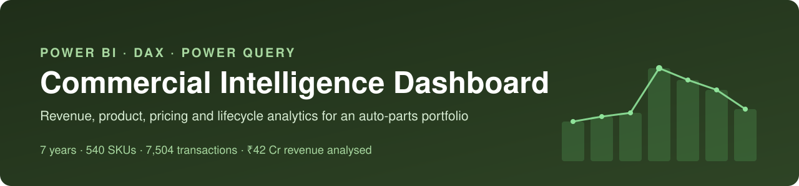
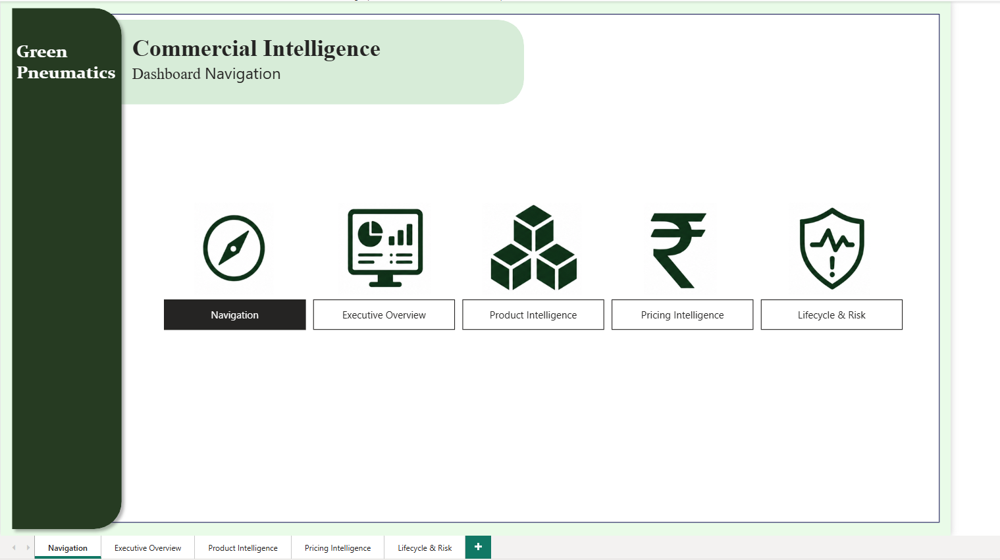
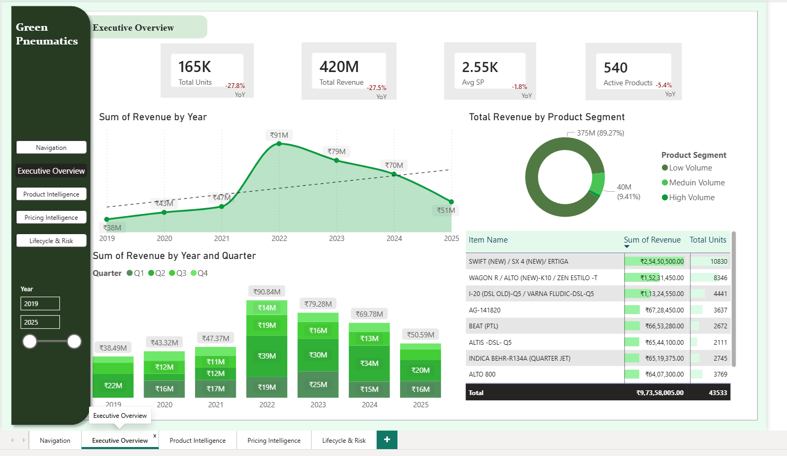
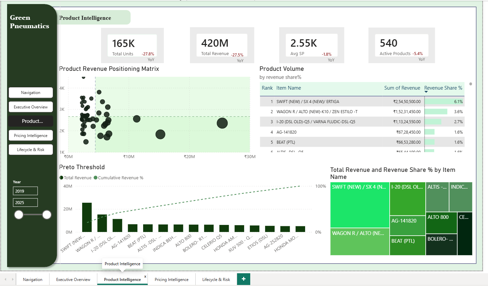
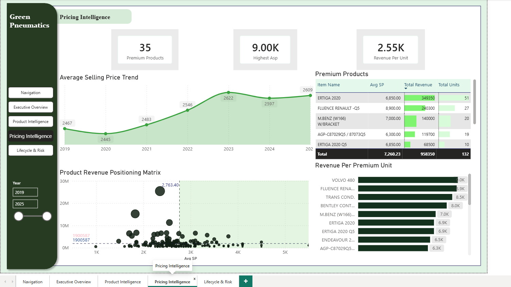
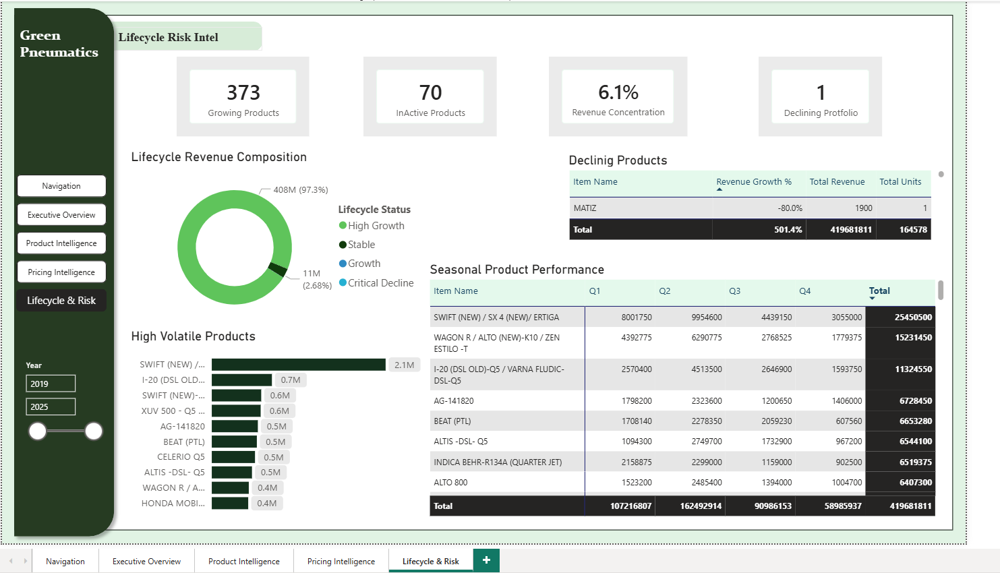
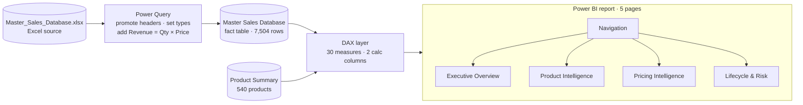
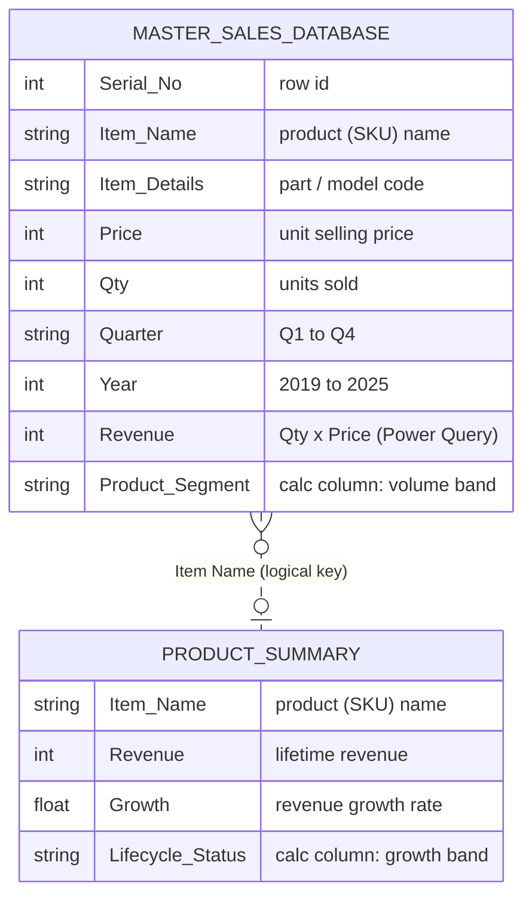
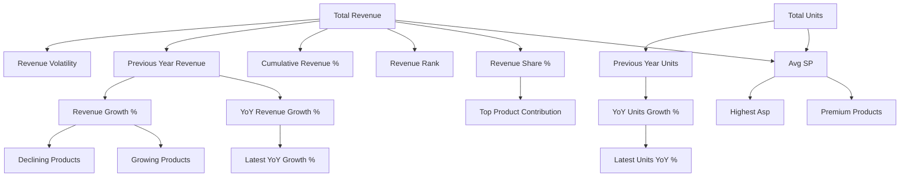

<p align="center">
  
</p>

<p align="center">
  
  
  
  
  
</p>

<p align="center">
  <a href="#-dashboard-preview">Preview</a> ·
  <a href="#-key-insights">Insights</a> ·
  <a href="#-solution-architecture">Architecture</a> ·
  <a href="#-data-model">Data model</a> ·
  <a href="#-repository-structure">Structure</a> ·
  <a href="#-how-to-use">How to use</a>
</p>

---

## 📌 Overview

An end-to-end **Power BI** solution that turns 7 years of raw sales transactions from an automotive parts distributor (anonymised as *Green Pneumatics*) into a 5-page commercial intelligence report.

It answers four management questions:

| # | Business question | Report page |
|---|---|---|
| 1 | How is the business performing, and where is the trend heading? | **Executive Overview** |
| 2 | Which products drive revenue, and how concentrated is it? | **Product Intelligence** |
| 3 | Are we pricing efficiently, and which products are premium? | **Pricing Intelligence** |
| 4 | Which products are growing, declining, volatile or seasonal? | **Lifecycle & Risk** |

**Scope:** 7,504 transactions · 540 SKUs · 2019 – 2025 · quarterly grain · ₹41.97 Cr total revenue.

---

## 🖥️ Dashboard Preview

<table>
  <tr>
    <td width="50%"><b>Navigation</b><br></td>
    <td width="50%"><b>Executive Overview</b><br></td>
  </tr>
  <tr>
    <td width="50%"><b>Product Intelligence</b><br></td>
    <td width="50%"><b>Pricing Intelligence</b><br></td>
  </tr>
  <tr>
    <td width="50%"><b>Lifecycle &amp; Risk</b><br></td>
    <td width="50%" valign="top">
      <b>Report features</b>
      <ul>
        <li>Landing page with icon navigation</li>
        <li>Persistent side-panel navigator on every page</li>
        <li>Global <b>Year</b> range slicer</li>
        <li>KPI cards with YoY variance</li>
        <li>Pareto (80/20) threshold chart</li>
        <li>Price × revenue positioning matrices</li>
        <li>Quarter-by-product seasonality matrix</li>
      </ul>
    </td>
  </tr>
</table>

Page-by-page walkthrough of every visual and the measures behind it → **[docs/report-pages.md](docs/report-pages.md)**

---

## 💡 Key Insights

> Figures below are computed from the model's data and match the report with the full 2019–2025 range selected.

| Theme | Finding |
|---|---|
| **Growth then contraction** | Revenue grew at a **33% CAGR** from ₹3.85 Cr (2019) to a peak of **₹9.08 Cr in 2022** (+92% YoY), then declined three years in a row to ₹5.06 Cr in 2025 — **−44% from peak**. |
| **Volume-led decline** | Average selling price kept *rising* (₹2,467 → ₹2,609, +5.8%) while units fell from 35.7K (2022) to 19.4K (2025). The drop is a **volume problem, not a pricing problem**. |
| **Broad SKU base** | No single-product dependency: the top SKU is only **6.1%** of revenue and the top 10 are **23.2%**. **129 SKUs (24%) generate 80%** of revenue; the remaining 411 share 20%. |
| **Strong seasonality** | **Q2 delivers 38.7%** of annual revenue vs **14.1% in Q4** — inventory and sales effort should be front-loaded into Q1–Q2. |
| **Long tail** | **70 SKUs** earned under ₹10K in seven years (7 earned nothing) — candidates for range rationalisation. |
| **Latest year** | 2024 → 2025: **246 SKUs declined vs 112 grew**, confirming the contraction is broad-based rather than driven by a few products. |

---

## 🏗️ Solution Architecture



| Layer | What happens | Details |
|---|---|---|
| **Extract** | Excel workbook loaded with `Excel.Workbook` | [docs/power-query.md](docs/power-query.md) |
| **Transform** | Header promotion, explicit data types, `Revenue` computed at row level | [docs/power-query.md](docs/power-query.md) |
| **Model** | Transaction fact table + product-level summary table | [docs/data-model.md](docs/data-model.md) |
| **Calculate** | Core KPIs, YoY engine, Pareto, ranking, lifecycle & risk measures | [docs/dax-measures.md](docs/dax-measures.md) |
| **Visualise** | 5 pages, 79 visual containers, shared navigation and Year slicer | [docs/report-pages.md](docs/report-pages.md) |

---

## 🧩 Data Model



### Measure map



Full DAX for every measure, grouped by purpose → **[docs/dax-measures.md](docs/dax-measures.md)**

---

## 📁 Repository Structure

```text
Commercial-Intelligence-Dashboard/
├── README.md                       ← you are here
├── dashboard/
│   └── Commercial-Intelligence-Dashboard.pbix   ← Power BI report + model
├── assets/
│   ├── banner.svg
│   └── screenshots/
│       ├── 00-navigation.png
│       ├── 01-executive-overview.png
│       ├── 02-product-intelligence.png
│       ├── 03-pricing-intelligence.png
│       └── 04-lifecycle-risk.png
└── docs/
    ├── data-model.md               ← tables, columns, data dictionary
    ├── power-query.md              ← M code and transformation steps
    ├── dax-measures.md             ← all 30 measures with explanations
    ├── report-pages.md             ← page-by-page visual & measure guide
    └── model-review.md             ← data-quality checks and v2 roadmap
```

---

## 🚀 How to Use

1. Install **[Power BI Desktop](https://powerbi.microsoft.com/desktop/)** (Windows, recent version).
2. Download [`dashboard/Commercial-Intelligence-Dashboard.pbix`](dashboard/Commercial-Intelligence-Dashboard.pbix) and open it — the data is already imported, so no source file is needed to explore the report.
3. Start on the **Navigation** page and use the side panel to move between pages; use the **Year** slider to change the analysis window.
4. *(Optional, to refresh)* point the query at your own workbook: **Transform data → Data source settings → Change source**. The expected columns are listed in [docs/data-model.md](docs/data-model.md).

---

## 🛠️ Tools & Skills Demonstrated

| Area | Applied in this project |
|---|---|
| **Power Query (M)** | Typed ingestion, calculated revenue column, repeatable refresh |
| **DAX** | `CALCULATE` / `FILTER` context control, `RANKX`, running-total Pareto, `STDEVX.P` volatility, YoY time comparisons, `SWITCH(TRUE())` banding |
| **Data modelling** | Fact table design, product-level summary, calculated columns vs measures |
| **Visual design** | Consistent theme, KPI cards with variance, landing-page navigation, page navigator |
| **Commercial analytics** | Revenue concentration, Pareto, price positioning, lifecycle segmentation, seasonality |
| **Data quality** | Name normalisation and code-mapping checks → [docs/model-review.md](docs/model-review.md) |

---

## 🗺️ Roadmap (v2)

- [ ] Star schema: `DimProduct` + `DimDate` with relationships to the fact table
- [ ] Pin YoY / growth measures to the latest two years selected
- [ ] Product-level (not row-level) volume segmentation
- [ ] SKU name normalisation + master mapping table
- [ ] Publish to Power BI Service with a public demo link

Details and rationale → [docs/model-review.md](docs/model-review.md)

---

## 👤 Author

**Tanmay Mandal** — Business Analyst · Operations & ERP analytics
GitHub: [@tanmaymandal0207-cmyk](https://github.com/tanmaymandal0207-cmyk)

<sub>Company name and branding are anonymised. Data is used for portfolio demonstration only.</sub>
