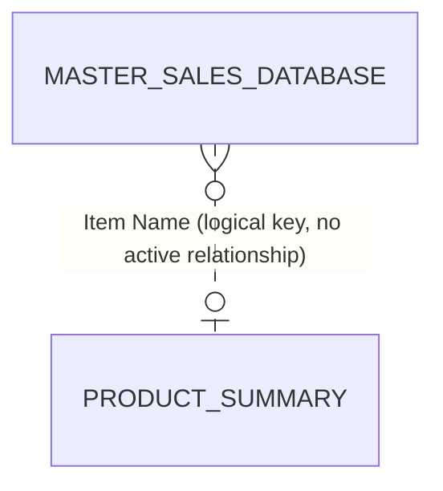

# Data Model

[← Back to README](../README.md)

The model has two tables. All report visuals are driven by **Master Sales Database**; **Product Summary** supplies the lifecycle classification used on the *Lifecycle & Risk* page.



| Table | Grain | Rows | Role |
|---|---|---:|---|
| Master Sales Database | 1 row per product × year × quarter | 7,504 | Fact table — every KPI and chart |
| Product Summary | 1 row per product | 540 | Lifecycle status per product |

> **Note:** there is no physical relationship between the two tables in v1. Visuals built on `Product Summary` therefore do not respond to the Year slicer. See [model-review.md](model-review.md#2-model-design-findings).

---

## Master Sales Database

**Source:** `Master_Sales_Database.xlsx`, sheet *Master Sales Database* (see [power-query.md](power-query.md)).

| Column | Type | Origin | Description | Example |
|---|---|---|---|---|
| Serial No | Whole number | Source | Row identifier | `6324` |
| Item Name | Text | Source | Product (SKU) name — vehicle / model descriptor | `SWIFT (NEW) / SX 4 (NEW)/ ERTIGA` |
| Item Details | Text | Source | Part or model code | `AG-163020` |
| Price | Whole number | Source | Unit selling price (₹) | `2700` |
| Quarter | Text | Source | Fiscal quarter label | `Q1` … `Q4` |
| Qty | Whole number | Source | Units sold in the quarter | `12` |
| Year | Whole number | Source | Calendar year | `2019` … `2025` |
| Revenue | Whole number | Power Query | `Qty × Price` | `32400` |
| Product Segment | Text | DAX calc column | Volume band — see below | `Low Volume` |

**Product Segment** (calculated column)

```DAX
Product Segment =
SWITCH(
    TRUE(),
    'Master Sales Database'[Total Units] > 1000, "High Volume",
    'Master Sales Database'[Total Units] > 300,  "Meduin Volume",
    "Low Volume"
)
```

| Band | Rule (units) |
|---|---|
| High Volume | > 1,000 |
| Medium Volume | 301 – 1,000 |
| Low Volume | ≤ 300 |

---

## Product Summary

| Column | Type | Description |
|---|---|---|
| Item Name | Text | Product (SKU) name — matches `Master Sales Database[Item Name]` |
| Revenue | Whole number | Lifetime revenue for the product (₹) |
| Growth | Decimal | Revenue growth rate |
| Lifecycle Status | Text | DAX calc column — growth band, see below |

**Lifecycle Status** (calculated column)

```DAX
Lifecycle Status =
SWITCH(
    TRUE(),
    'Product Summary'[Growth] > 0.15,  "High Growth",
    'Product Summary'[Growth] > 0,     "Growth",
    'Product Summary'[Growth] = 0,     "Stable",
    'Product Summary'[Growth] > -0.15, "Declining",
    "Critical Decline"
)
```

| Status | Growth rule |
|---|---|
| High Growth | > +15% |
| Growth | 0% to +15% |
| Stable | exactly 0% (or blank — see review) |
| Declining | −15% to 0% |
| Critical Decline | ≤ −15% |

---

## Data profile

| Metric | Value |
|---|---:|
| Years covered | 2019 – 2025 (7) |
| Distinct products (Item Name) | 540 |
| Distinct part codes (Item Details) | 433 |
| Distinct price points | 115 |
| Total units | 164,578 |
| Total revenue | ₹41,96,81,811 |
| Rows with `Qty = 0` | 2,244 (29.9%) |

Revenue by year:

| Year | Revenue (₹) | Units | Products sold | Avg SP (₹) | YoY |
|---|---:|---:|---:|---:|---:|
| 2019 | 3,84,85,572 | 15,601 | 210 | 2,467 | — |
| 2020 | 4,33,24,541 | 17,718 | 230 | 2,445 | +12.6% |
| 2021 | 4,73,68,211 | 19,075 | 236 | 2,483 | +9.3% |
| 2022 | 9,08,42,192 | 35,684 | 275 | 2,546 | +91.8% |
| 2023 | 7,92,82,670 | 30,239 | 315 | 2,622 | −12.7% |
| 2024 | 6,97,84,505 | 26,869 | 312 | 2,597 | −12.0% |
| 2025 | 5,05,94,120 | 19,392 | 296 | 2,609 | −27.5% |

*"Products sold" counts products with `Qty > 0` in the year.*
