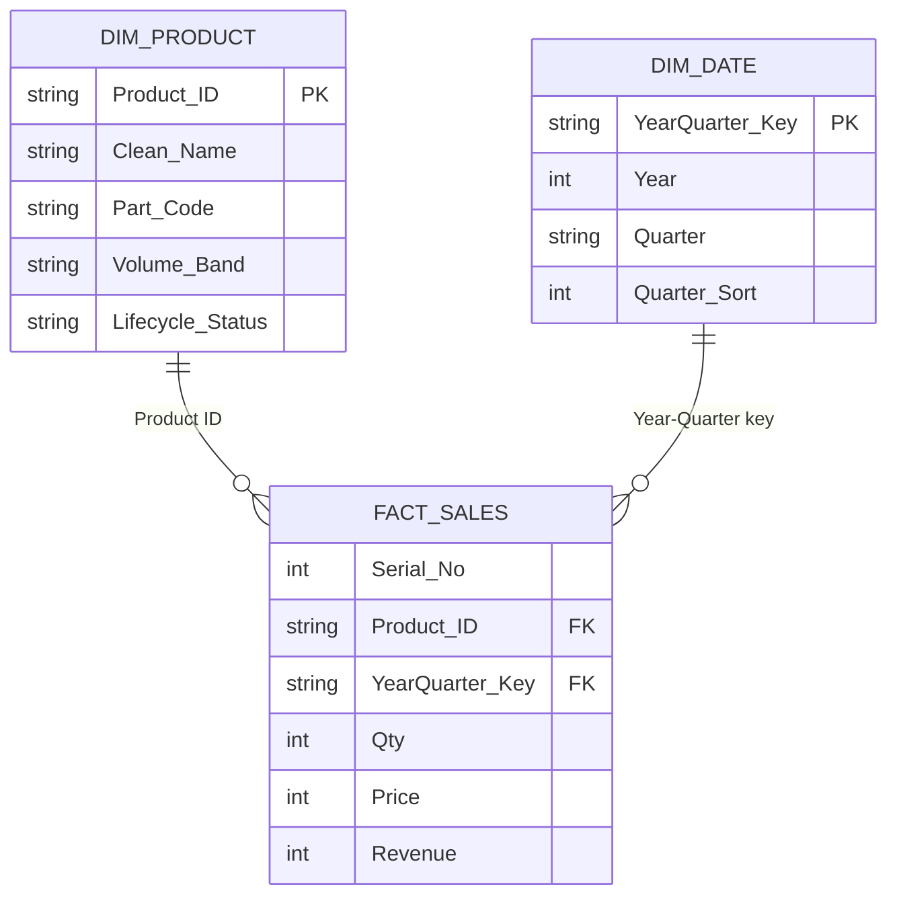

# Model Review & v2 Roadmap

[← Back to README](../README.md)

A self-audit of the v1 data and model: what was checked, what was found, and the fix planned for each item. Every number below was reproduced directly from the model's data.

---

## 1. Data-quality findings

| # | Check | Result | Impact | v2 fix |
|---|---|---|---|---|
| D1 | Product-name normalisation (upper-case, strip spaces and punctuation) | **5 pairs** of names collapse into one product, e.g. `CRETA PTL-Q5` / `CRETA PTL Q5`, `KUV - 100 (BEHR)` / `KUV 100 BEHR`, `BREEZA DSL-Q5` / `BREEZA DSL Q5` | Revenue for one physical product is split across two rows in rankings and Pareto | Normalise in Power Query + master mapping table |
| D2 | Hidden characters | Non-breaking space (`U+00A0`) found in `FLUENCE RENAULT -Q5` | Visually identical names fail to match | `Text.Replace(_, "#(00A0)", " ")` + `Text.Clean` |
| D3 | Name ↔ part-code mapping | **18** names map to more than one part code (e.g. `JAZZ T2` → `AG-86964` and `AG-86965Q5`); **122** part codes appear under more than one name | `Item Name` is not a reliable unique key | Use a surrogate `Product ID` from a `DimProduct` table |
| D4 | Zero-quantity rows | **2,244 of 7,504** rows (29.9%) have `Qty = 0` | Inflates row counts; no effect on revenue totals | Keep for continuity, flag with `Is Sold = Qty > 0` |
| D5 | Duplicate business keys (Item × Year × Quarter) | **8 rows** — all from D3 (`JAZZ T2`, 2021) | Same as D3 | Resolved by D3 fix |
| D6 | Price consistency | Each product has a single price across all sold rows | ✅ No issue | — |

### Planned normalisation table

```text
Raw Item Name          →  Clean Key            →  Product ID
CRETA PTL-Q5              CRETAPTLQ5              P-0142
CRETA PTL Q5              CRETAPTLQ5              P-0142
KUV - 100 (BEHR)          KUV100BEHR              P-0217
KUV 100 BEHR              KUV100BEHR              P-0217
```

---

## 2. Model-design findings

| # | Area | Observation | v2 fix |
|---|---|---|---|
| M1 | **Product growth measures** | `Revenue Growth %` compares revenue for the *whole selected range* with revenue for `MAX(Year) − 1` only. With 2019–2025 selected it compares 7 years against 1, so most products show as "growing" (373 in v1). A strict latest-year comparison (2025 vs 2024) gives **112 growing / 246 declining** products. | Pin both sides to explicit years (below) |
| M2 | **Product Segment** column | A calculated column that references the `[Total Units]` measure is evaluated per *row*, not per product, so 7,462 of 7,504 rows land in "Low Volume". Evaluated per product the split is **35 High / 101 Medium / 404 Low**. Label typo: "Meduin". | Compute at product level with `ALLEXCEPT` |
| M3 | **Lifecycle Status** | 166 products have a blank `Growth`; in DAX `BLANK() = 0` is `TRUE`, so they are classified as "Stable". | Add an explicit `ISBLANK` branch → "No History" |
| M4 | **Relationships** | `Product Summary` has no relationship to the fact table, so the lifecycle donut ignores the Year slicer. | Star schema: `DimProduct` + `DimDate` |
| M5 | **Revenue Share %** | Denominator uses `ALL('Master Sales Database')`, i.e. lifetime revenue, so shares within a filtered year do not add to 100%. | Use `ALLSELECTED` on the product column |
| M6 | **Premium Products** | `FILTER(ALL(...))` removes the Year filter, so the card always shows the all-time count (35). | Iterate `VALUES('…'[Item Name])` |
| M7 | Time intelligence | Year-only grain with text quarters; no date table. | `DimDate` (Year, Quarter, sort order) |

### Corrected DAX (v2)

```DAX
-- M1: latest-year product growth, independent of the selected range length
Revenue Growth % =
VAR LatestYear =
    CALCULATE ( MAX ( 'Master Sales Database'[Year] ), ALLSELECTED ( 'Master Sales Database' ) )
VAR CY =
    CALCULATE ( [Total Revenue], 'Master Sales Database'[Year] = LatestYear )
VAR PY =
    CALCULATE ( [Total Revenue], 'Master Sales Database'[Year] = LatestYear - 1 )
RETURN
    DIVIDE ( CY - PY, PY )
```

```DAX
-- M2: product-level volume band
Product Segment =
VAR ProductUnits =
    CALCULATE (
        SUM ( 'Master Sales Database'[Qty] ),
        ALLEXCEPT ( 'Master Sales Database', 'Master Sales Database'[Item Name] )
    )
RETURN
    SWITCH (
        TRUE (),
        ProductUnits > 1000, "High Volume",
        ProductUnits > 300,  "Medium Volume",
        "Low Volume"
    )
```

```DAX
-- M3: do not treat missing growth as zero
Lifecycle Status =
SWITCH (
    TRUE (),
    ISBLANK ( 'Product Summary'[Growth] ), "No History",
    'Product Summary'[Growth] > 0.15,      "High Growth",
    'Product Summary'[Growth] > 0,         "Growth",
    'Product Summary'[Growth] = 0,         "Stable",
    'Product Summary'[Growth] > -0.15,     "Declining",
    "Critical Decline"
)
```

```DAX
-- M5: share of the currently selected total
Revenue Share % =
DIVIDE (
    [Total Revenue],
    CALCULATE ( [Total Revenue], ALLSELECTED ( 'Master Sales Database'[Item Name] ) )
)
```

```DAX
-- M6: respect the Year slicer
Premium Products =
COUNTROWS (
    FILTER ( VALUES ( 'Master Sales Database'[Item Name] ), [Avg SP] > 5000 )
)
```

---

## 3. Target v2 model



## 4. Validation checklist (run after each refresh)

| Check | Expected |
|---|---|
| `SUM(Revenue)` = `SUMX(Qty × Price)` | Equal |
| Revenue Share % summed over products (current selection) | 100% |
| Rows in fact table vs source sheet | Equal |
| Products without a `DimProduct` match | 0 |
| Growing + Declining + Flat + New products | = Active products |
