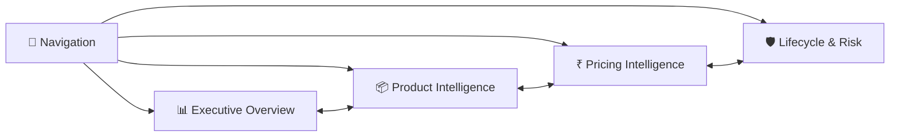

# Report Pages

[← Back to README](../README.md)

Every analysis page shares the same frame: **side-panel page navigator** · **Year range slicer** · **page title banner**. Canvas size 1280 × 720.

| Page | Question it answers | Visuals |
|---|---|---:|
| [Navigation](#0-navigation) | Where do I go? | 11 |
| [Executive Overview](#1-executive-overview) | How is the business trending? | 20 |
| [Product Intelligence](#2-product-intelligence) | What drives revenue? | 19 |
| [Pricing Intelligence](#3-pricing-intelligence) | Are we pricing efficiently? | 14 |
| [Lifecycle & Risk](#4-lifecycle--risk) | What is growing, declining or volatile? | 15 |

---

## 0. Navigation

Landing page with one icon + button per report section, built with a page-navigator visual so new pages are picked up automatically.

---

## 1. Executive Overview

| Visual | Type | Fields / measures |
|---|---|---|
| KPI cards ×4 | Card | `Total Units`, `Total Revenue`, `Average SP`, `Active Products` |
| YoY variance ×4 | Card | `Latest Units YoY %`, `Latest YoY Growth %`, `YoY Avg SP %`, `Latest Active Products YoY %` |
| Revenue by Year | Area / line + trend | `Year` · `Revenue` |
| Revenue by Year and Quarter | Stacked column | `Year` · `Quarter` · `Revenue` |
| Revenue by Product Segment | Donut | `Product Segment` · `Total Revenue` |
| Top products | Table with data bars | `Item Name` · `Revenue` · `Total Units` |

**How to read it:** the trend line shows the 2022 peak and the three-year decline; the stacked columns show Q2 is the largest quarter in 5 of 7 years (Q1 led in 2020–2021).

---

## 2. Product Intelligence

| Visual | Type | Fields / measures |
|---|---|---|
| KPI strip | Card ×8 | Same KPIs + YoY as Executive Overview |
| Product Revenue Positioning Matrix | Scatter (bubble = units) | X `Revenue` · Y `Avg SP` · size `Total Units` · tooltip `Revenue Share %` |
| Product Volume | Ranked table | `Revenue Rank` · `Item Name` · `Revenue` · `Revenue Share %` |
| Pareto Threshold | Column + line combo | `Total Revenue` (columns) · `Cumulative Revenue %` (line) |
| Revenue share by item | Treemap | `Item Name` · `Total Revenue` |

**How to read it:** the Pareto line crosses 80% at roughly the 129th product — revenue is spread across a wide range rather than a handful of hero SKUs.

---

## 3. Pricing Intelligence

| Visual | Type | Fields / measures |
|---|---|---|
| KPI cards ×3 | Card | `Premium Products`, `Highest Asp`, `Revenue Per Unit` |
| Average Selling Price Trend | Area / line | `Year` · `Avg SP` |
| Price vs Revenue Matrix | Scatter (bubble = units) | X `Avg SP` · Y `Total Revenue` · size `Total Units` |
| Premium Products | Table | `Item Name` · `Avg SP` · `Total Revenue` · `Total Units` |
| Revenue Per Premium Unit | Bar | `Item Name` · `Revenue Per Unit` |

**How to read it:** ASP rises steadily while volumes fall — the business held price. Premium products (ASP > ₹5,000) are few and low-volume.

---

## 4. Lifecycle & Risk

| Visual | Type | Fields / measures |
|---|---|---|
| KPI cards ×4 | Card | `Growing Products`, `Dead Products` (Inactive), `Top Product Contribution`, `Declining Products` |
| Lifecycle Revenue Composition | Donut | `Product Summary[Lifecycle Status]` · `Revenue` |
| Declining Products | Table | `Item Name` · `Revenue Growth %` · `Total Revenue` · `Total Units` |
| High Volatile Products | Bar | `Item Name` · `Revenue Volatility` |
| Seasonal Product Performance | Matrix | Rows `Item Name` · Columns `Quarter` · `Total Revenue` |

**How to read it:** volatility ranks products by how much their yearly revenue swings; the seasonal matrix shows the Q2 peak at product level.

> Growth counts on this page are being re-based to a strict latest-year comparison in v2 — see [model-review.md](model-review.md#2-model-design-findings).
